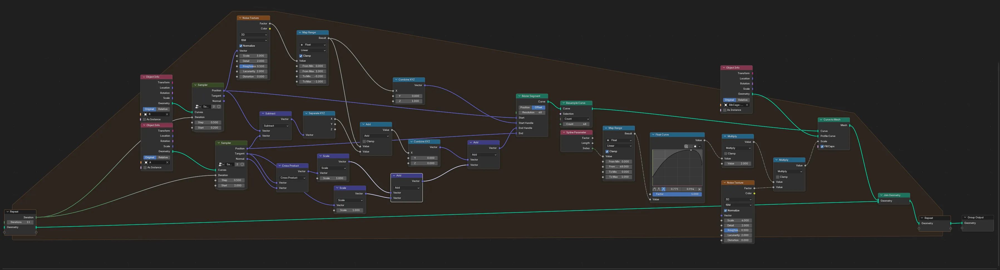
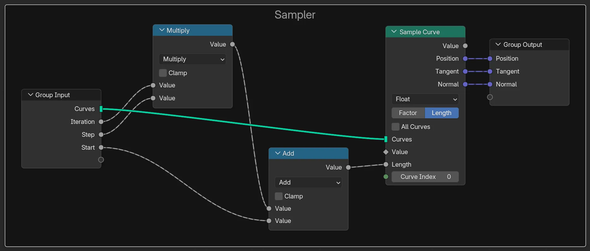

# Cage thoraxique

Cette méthode crée la moitié d'une cage thoraxique. L'autre moitié s'obtient par miroir X.

Pour cela, il faut créer deux courbes de Bézier :

* **`A`** : Dans le plan YZ. C'est la ligne du sternum.
* **`B`** : Dans un plan parallèle au plan XY. C'est la ligne de la fin des côtes.

Ensuite, on applique ces Geometry Nodes :

