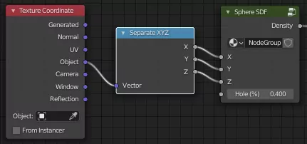

# How to do SDF?

Download the [Blender 2.93.4 file](sdf.blend).

SDF function for a donut is: `(√(x² + y²) - R²) + z² - r² < 0`.

1. Create a simple cube.
2. Remove the **Surface Shader** but add a **Volume Shader**. We will use the density of absorbtion volume.
  
3. All the maths are done with **Converter/Math** nodes.
  
4. `x`, `y` and `z` have to be taken from **texture coordinates**
  

